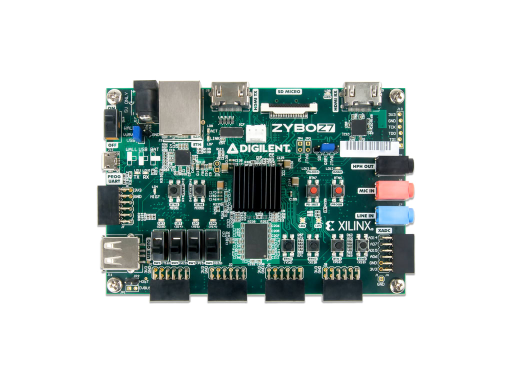
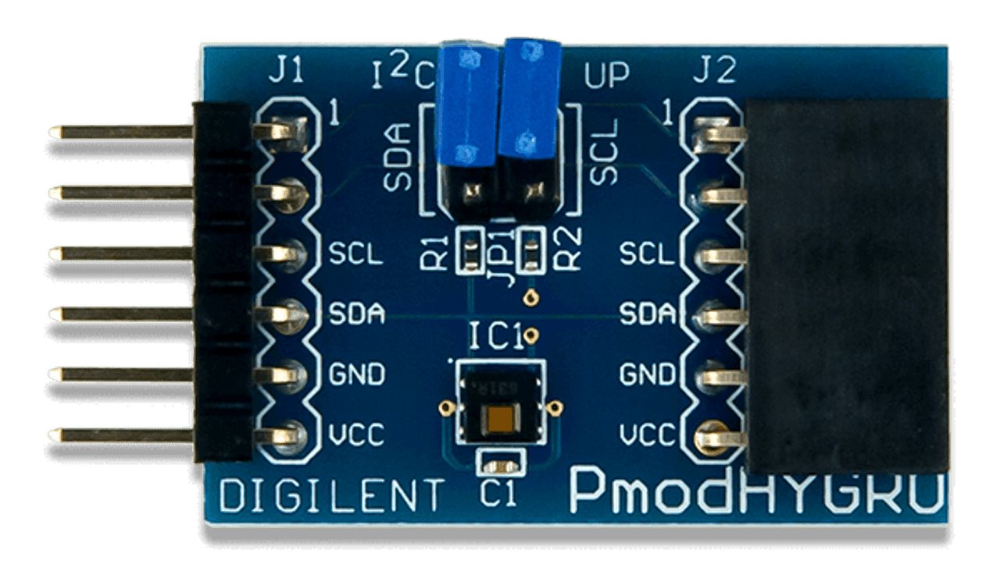
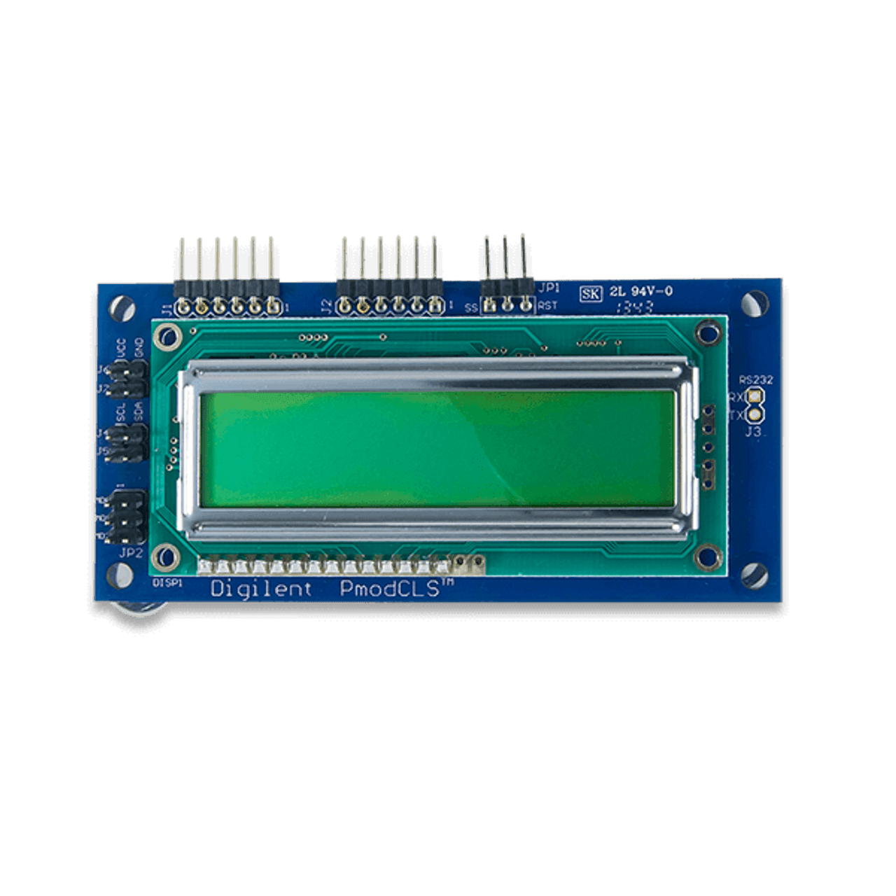
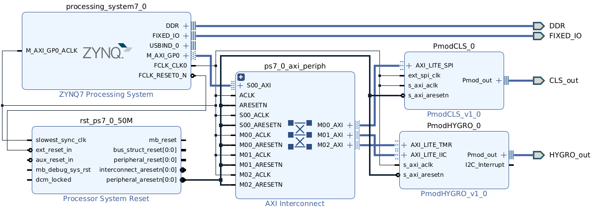
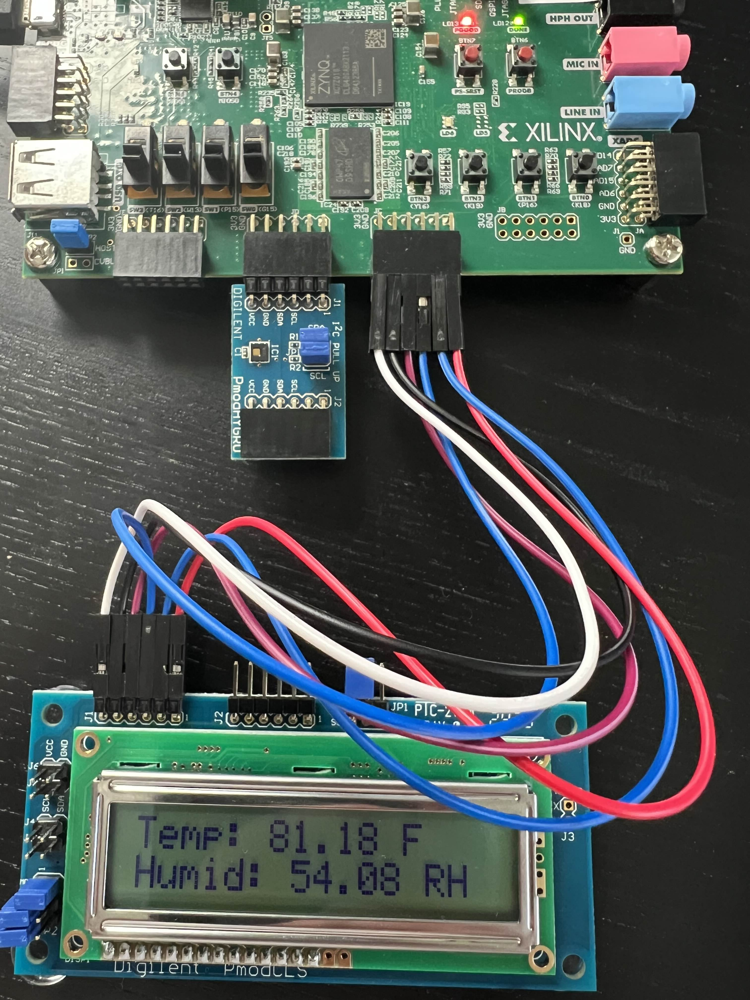
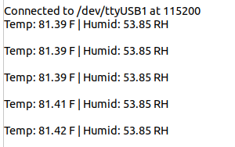

# Hygro CLS Project

## Overview

This embedded systems project uses Vivado IP integrator and Xilinx SDK/Vitis to interface with two Digilent Pmods:
- **PmodHYGRO**: Captures temperature and humidity from the environment via I²C.
- **PmodCLS**: Displays the sensor readings on a 16x2 LCD using SPI.

The system is implemented on a Zynq-7000 SoC (Zybo Z7-10), combining both hardware and software components. The design utilizes IP blocks to handle peripheral interfaces and communication protocols.

---

## Hardware

| Zybo Z7-20 Board | PmodHYGRO | PmodCLS |
|------------------|-----------|---------|
|  |  |  |

---

## Block Design

| Vivado Block Design |
|---------------------|
|  |

---

## Final Results

| CLS LCD Output | Vitis Serial Terminal |
|----------------|------------------------|
|  |  |

## Tasks

- [ ] Add video demo.
- [ ] Add screenshots.
- [ ] Add additional features:
  - Log data to UART
  - Add Fahrenheit/Celsius toggle via button
  - Display min/max values
- [ ] Create alternate version using RTL/HDL (without Vivado IP integrator)
- [ ] Create alternate version using I²C and UART modes for CLS Pmod (instead of SPI)

---

## Requirements

- Zybo Z7-10 FPGA board
- Digilent PmodCLS 
- Digilent PmodHYGRO 
- Vivado + Vitis (2020.2 or later recommended)